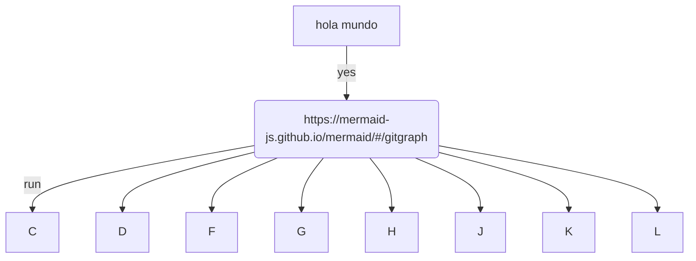

# projects-go
 Proyectos con go 

```mermaid
  graph TD;
      A[hola mundo]--yes-->B(https://mermaid-js.github.io/mermaid/#/gitgraph);
      B--run-->C;
      B-->D;
       B-->F;
        B-->G;
         B-->H; B-->J;
          B-->K;
           B-->L;
         
    
```
